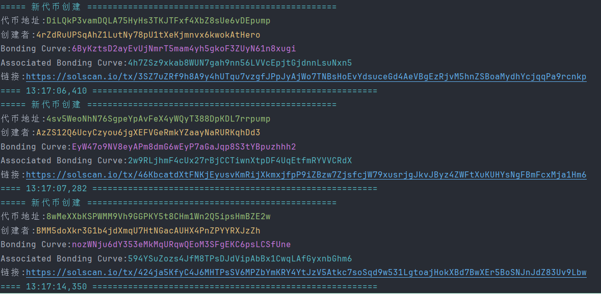

# Solana Yellowstone gRPC C# 示例项目

## 项目概述

本项目提供了使用 C# 接入 Solana Yellowstone gRPC 服务的完整示例。Yellowstone gRPC 是一个高性能的 Solana 区块链数据订阅服务，支持实时获取区块链数据，包括 Slot 更新、区块信息、账户变更等。

## 环境要求
- .NET 8.0 SDK
- Visual Studio 2022 或 VS Code
- Git

## 快速开始

### 1. 克隆项目

```bash
git clone https://github.com/ChainBuff/yellowstone-grpc-csharp.git
cd yellowstone-grpc-csharp
```

### 2. 安装依赖包

```bash
dotnet restore
```

## 项目结构

本项目包含两个示例程序：

### 00-sub - 基础订阅示例
- Slot 数据订阅的基础实现
- 演示如何建立 gRPC 连接
- 展示数据订阅配置
- [查看详细说明](./00-sub/)

### 01-format - 区块数据订阅示例
- 完整的区块数据订阅实现
- 支持账户交易监控
- 包含详细的数据解析示例
- [查看详细说明](./01-format/)


### 02-txn-parser - 解析交易
- 数据解析示例
- [查看详细说明](./02-txn-parser/)

### 03-snipe-pump -阻击pump新代币
- 使用GPRC订阅PUMP新代币

- [查看详细说明](./03-snipe-pump/)

## 关键特性

- 使用配置文件管理连接参数
- 支持多种订阅过滤器
- 实时数据推送
- 心跳保活机制
- 异步处理

## 配置说明

每个示例项目都包含独立的 `appsettings.json` 配置文件：

```json
{
  "GrpcService": {
    "Endpoint": "https://solana-yellowstone-grpc.publicnode.com:443",
    "Commitment": "Processed"
  }
}
```

## 常见问题

1. gRPC 连接问题
   - 确保防火墙允许对应端口
   - 验证 Endpoint 地址正确
   - 检查网络连接状态

2. 数据订阅问题
   - 确认 Commitment 级别设置
   - 检查过滤器配置
   - 验证账户地址格式

## 贡献指南

欢迎提交 Issue 和 Pull Request 来完善项目。在提交代码前请确保：

1. 遵循现有代码风格
2. 添加适当的注释
3. 更新相关文档

## 参考资源

- [Solana 开发文档](https://docs.solana.com/)
- [Yellowstone-grpc 文档](https://docs.helius.dev/yellowstone-grpc/getting-started)
- [gRPC 官方文档](https://grpc.io/docs/)

